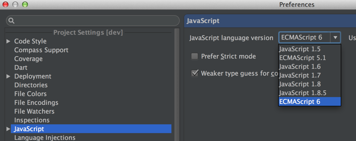
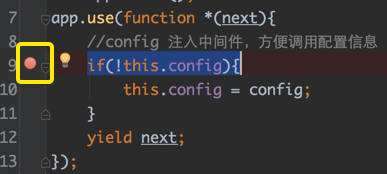

# 编辑器与调试

前端使用的编辑器五花八门，主流的有 webstorm 或 phpstorm、Sublime Text、vim等，用于编写 node 应用，推荐使用 [webstorm](http://www.jetbrains.com/webstorm/)。

* 支持 cmd 语法，且可以检查依赖模块路径的正确性
* 错误检查
* 内置 node 调试服务
* 内置命令行工具
* 内置单元测试工具
* 支持ES6语法
* 集成了git版本控制

### 开启 ES6 支持

由于 koa 应用会使用 ES6 的语法，所以我们修改 webstorm js的配置，避免语法误报错：

### 在 webstorm 中启动 koa 应用

打开 book/app.js ，选择菜单的 "Run"：

点击配置编辑，我们需要调整下配置：

留意 node 参数配置，我们需要把 --harmony 配置上。

除了可以配置 node 参数外，还可以配置应用的环境变量。

比如我们配置个 NODE_ENV=local，用于开启本地环境配置：

配置完成后，我们就可以使用 webstorm 来启动 koa 应用，菜单 “Run” -> “Run book”，启动成功后：

左侧按钮依次是 重启、停止、暂停。

### 在 webstorm 中调试 koa 应用

打开 book/app.js ，我们在第九行打个断点（点击第九行行号右侧空白处）：

点击菜单 “Run” -> “Debug book” ,访问 http://localhost:3000 :

就会断在第九行，可以查看变量信息，debug 过程跟浏览器断点调试差不多，可以通过面板的右上角按钮控制debug。

debug 的调试效率远比 console.log() 来的高，推荐使用。

webstorm 也集成了单元测试工具，这等到讲解 koa 应用单元测试时，我们再来讲解。

