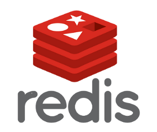

# 什么是 redis ？

[Redis](http://www.redis.cn/) 是一个开源的内存数据库服务器， 相对于传统数据，它快的惊人，是高性能Key-Value存储系统，在商业应用领域常用于缓存用途（二级存储）。

阿里云基于 redis 做了个 [KVStore](http://www.aliyun.com/product/kvstore) 的云服务产品，推荐了解下，除了贵，其他都很好...

其实人们低估了 redis，除了缓存用途外，redis 一样可以像 mySQL 一样作为主存储，redis 拥有独一无二的数据模型，它的 value 有 5 种不同类型，可以覆盖大部分的数据结构场景，比如我写的 [apebook 图书服务](http://apebook.org) 就是使用 redis 作为存储服务。

这一章只会重点讲解 redis 结合 node 常见的几种用法，更详细的 redis 内容，建议大家购买[《 redis 实战》](https://s.taobao.com/search?initiative_id=tbindexz_20151118&ie=utf8&spm=a21bo.7724922.8452-taobao-item.2&sourceId=tb.index&search_type=item&ssid=s5-e&commend=all&imgfile=&q=redis%E5%AE%9E%E6%88%98&suggest=history_1&_input_charset=utf-8&wq=redis&suggest_query=redis&source=suggest)。

## 论 redis 的重要性

商业级别应用，一般都会有个缓存层，用于提高应用的响应速度与减轻服务器压力，缓存的方案非常多，redis 是其中的佼佼者，下面来简单对比下几种在 node 里面常见的缓存方案。

### 使用内存

将数据缓存到内存是最简单的方案，也是最危险的方案，node 相对而言更容易出现内存泄露的问题，不适宜存储大数据消耗内存，不具有持久化能力，应用一旦重启，cache 就消息。

npm 上有大量内存 cache 模块，推荐的有 [memory-cache](https://www.npmjs.com/package/memory-cache)、[super-cache](https://www.npmjs.com/package/super-cache)。

不建议在商业级别应用中使用内存缓存数据。

### 

### redis

首先 redis 是内存数据库，非常快；
其次 redis 拥有持久化能力，可以保证缓存数据不丢失；
最后 redis 拥有多种数据类型，可以应对更复杂的业务场景。

## 除了缓存，redis 还可以干什么？

redis超强的扩展性，非常适合存储次要数据，比如页面的 pv；

